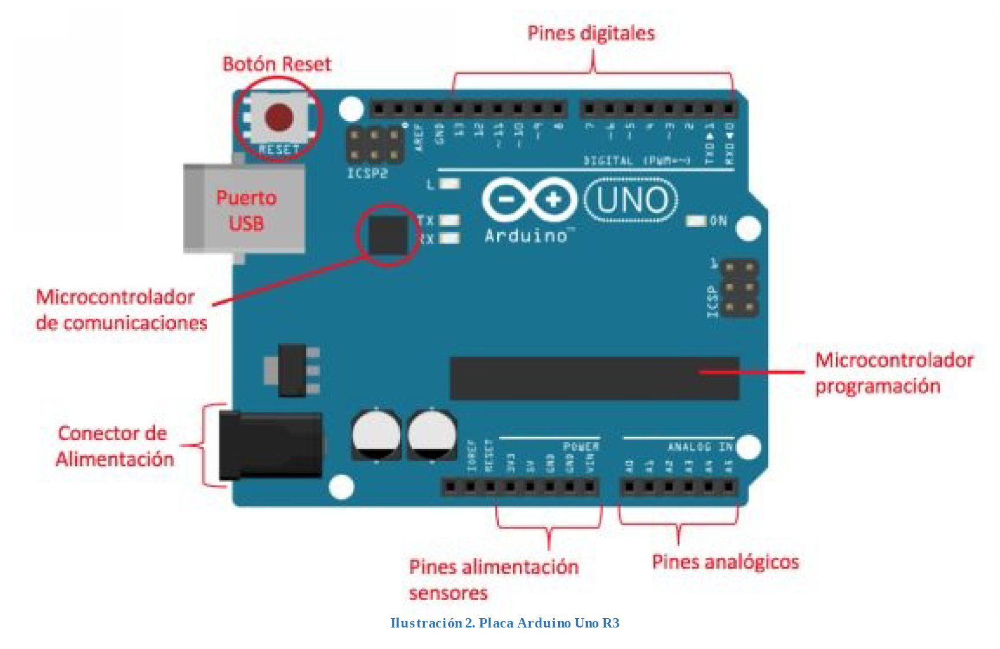
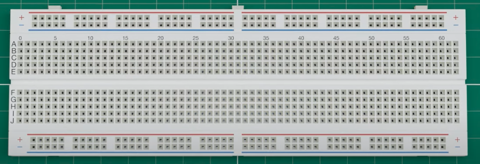
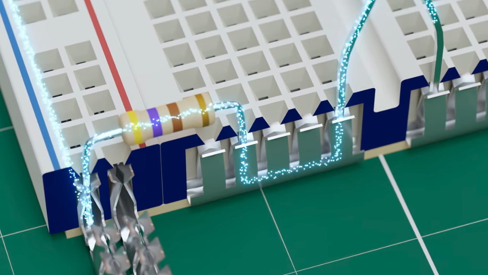
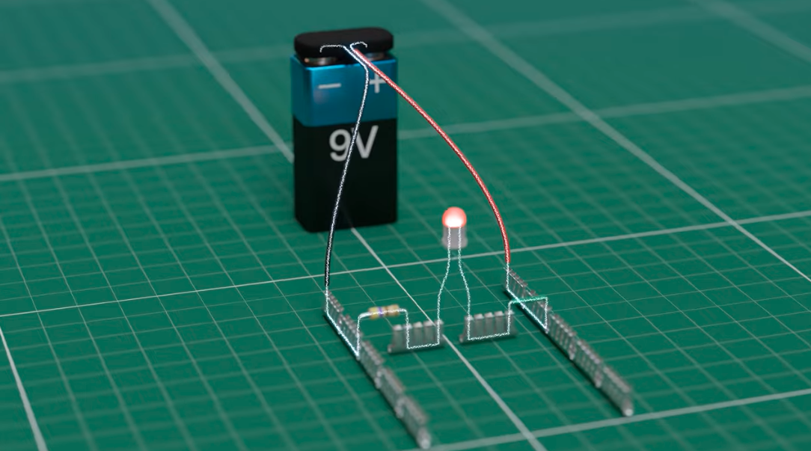
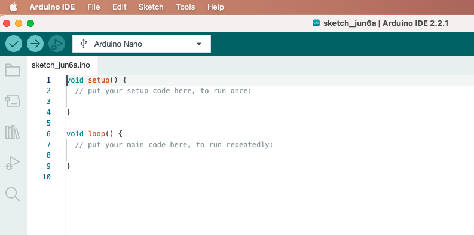

# Arduino

Arduino es una plataforma de código abierto de prototipos electrónicos que se basa en hardware y software flexibles y fáciles de usar que ponen al alcance de cualquier persona la construcción de circuitos electrónicos.

### Componentes Principales de Arduino

**Placas de Desarrollo:**
Hay varios modelos de placas Arduino, como el Arduino Uno, Arduino Mega, y Arduino Nano, entre otros. Cada una de las placas lleva un microcontrolador en el que se carga el programa que se quiera ejecutar.

**Microcontrolador:**
Es el cerebro de la placa Arduino. Es donde la placa almacena el programa que tiene que ejecutar.

El microcontrolador de la placa se programa utilizando el IDE de Arduino.

**Entradas y Salidas (I/O):**
Las placas Arduino tienen pines de entrada y salida digital y analógica que permiten la interacción con sensores, actuadores y otros componentes electrónicos.

**IDE de Arduino:**
El Entorno de Desarrollo Integrado de Arduino es una aplicación que se utiliza para escribir, compilar y cargar programas en las placas Arduino. Utiliza un lenguaje de programación basado en C/C++.

### Componentes comunes en los montajes

**Protoboard:**
Es una placa de plástico con contactos metálicos que nos permite montar circuitos eléctricos y electrónicos de manera fácil, temporal y sin tener que soldar.

Dentro del **protoboard** hay laminillas metálicas conductoras que permiten interconectar componentes y permiten el flujo de la corriente eléctrica.

La corriente de carga negativa pasa por la línea azul, donde está conectada la resistencia. La resistencia también está conectada en el canal central, en este canal está conectada la carga negativa del led (cátodo - pata corta). El ánodo (pata larga y positiva). No se ve en la imagen, pero el ánodo está conectado a la carga positiva.

No importa si la resistencia está conectada antes de la carga negativa o de la carga positiva. Pero necesitamos conectar una resistencia porque el led no soporta el voltaje tan alto y podría petar.

Sí que es importante hacer las conexiones en los agujeros correctos. Si conectamos la carga negativa de la pila en el canal de - de protoboard, no podemos conectar la resistencia o el cátodo al + del protoboard.

### IDE de Arduino

**Estructura de un programa**

El programa en Arduino está compuesto por dos secciones diferentes y obligatorias en las que se codifican diferentes componentes del programa.

En la primera sección del programa, **setup()**, es donde se define la configuración del programa, es decir, donde se codifican todas las sentencias de configuración, inicialización de los puertos de la placa, configuración de las comunicaciones y otros parámetros que dependerán de cada programa que se desarrolle.

En la segunda sección del programa, **loop()**, es donde se codifica el programa que se ejecutará de forma cíclica en Arduino. Esta sección está compuesta por todas las sentencias que componen el programa y que llevarán a cabo todas las operaciones que lo compongan.
