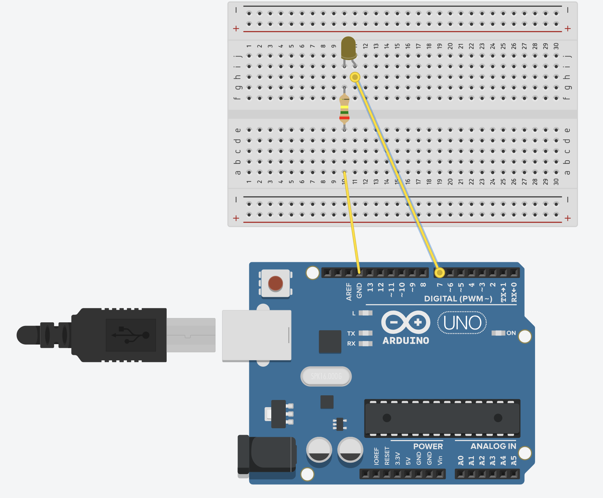
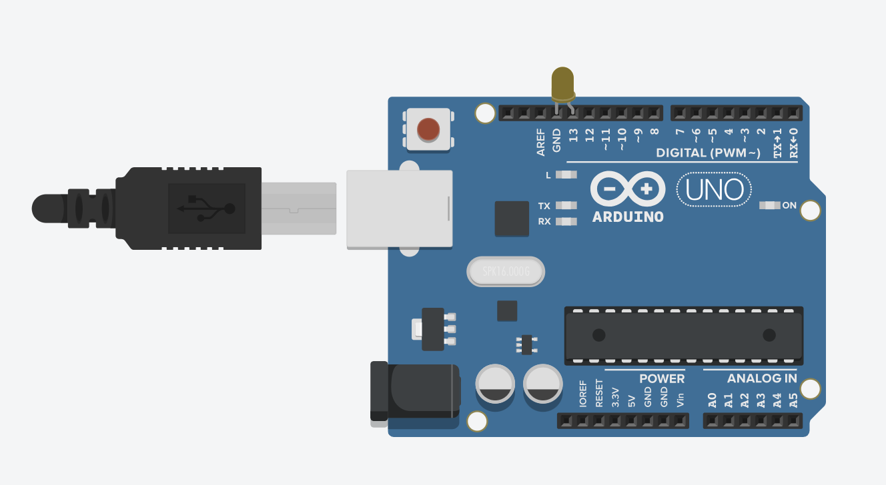
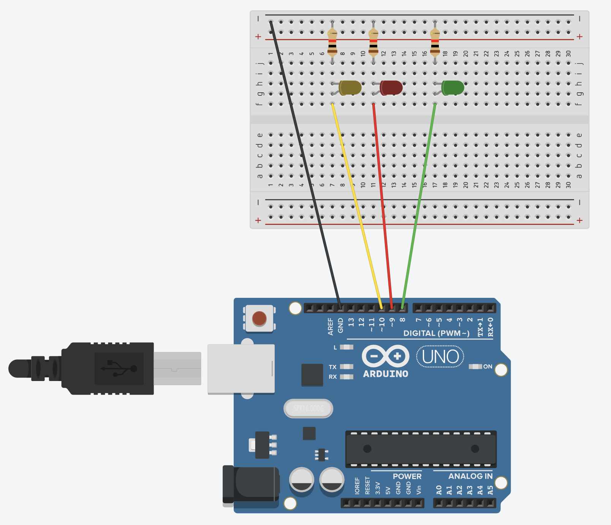
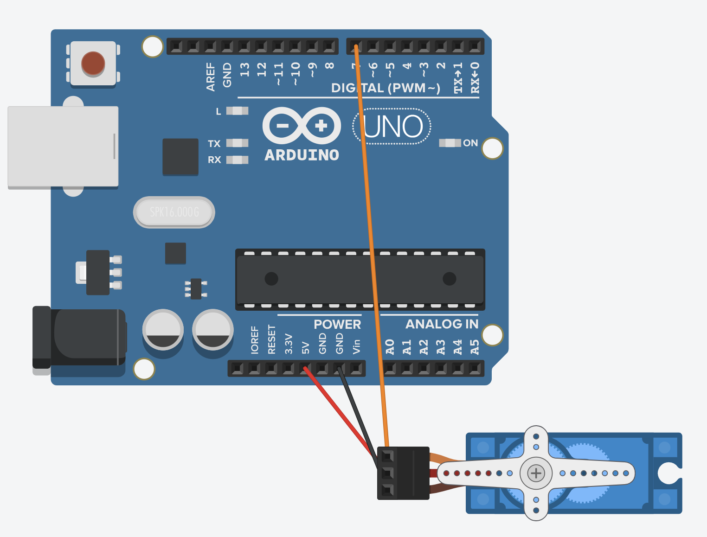
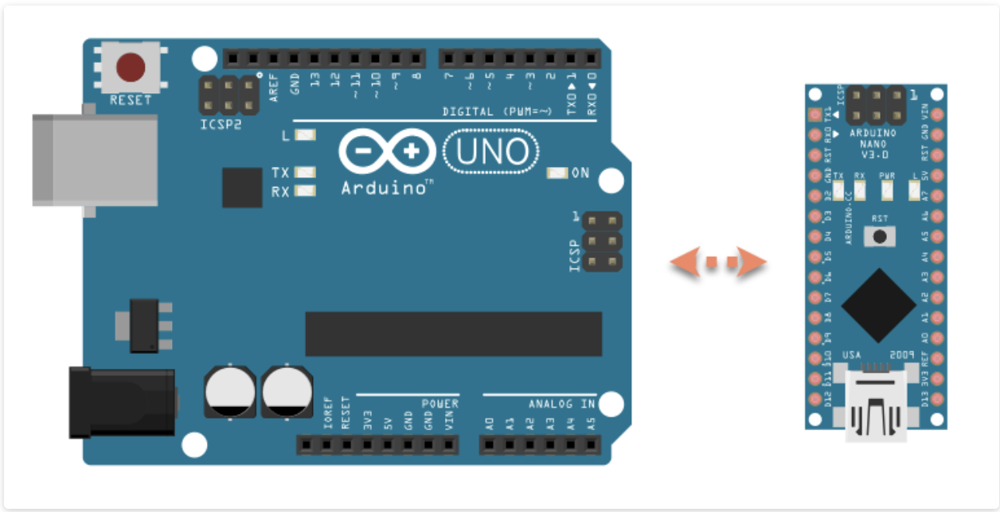
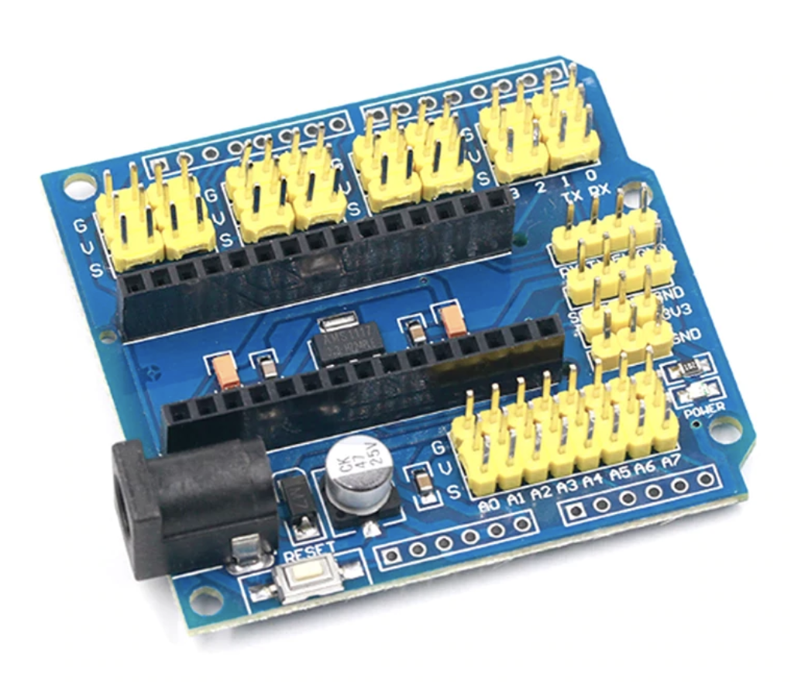
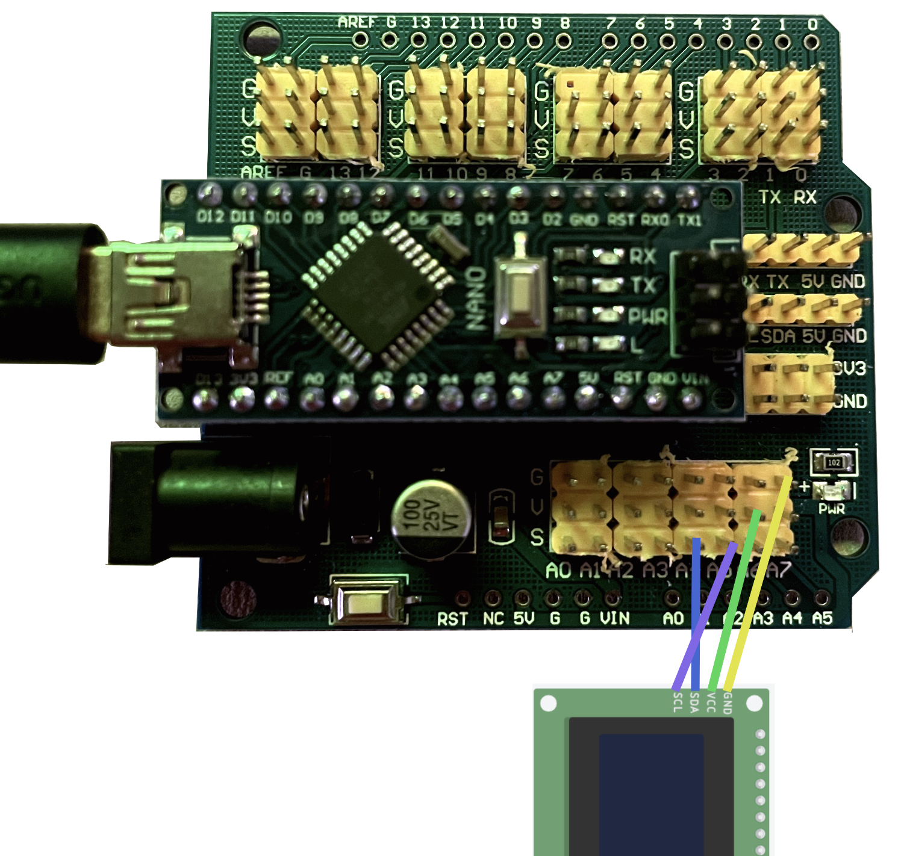
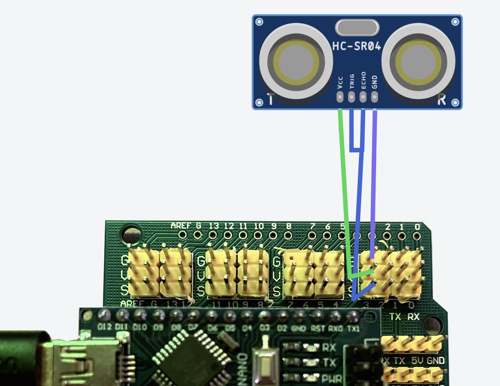
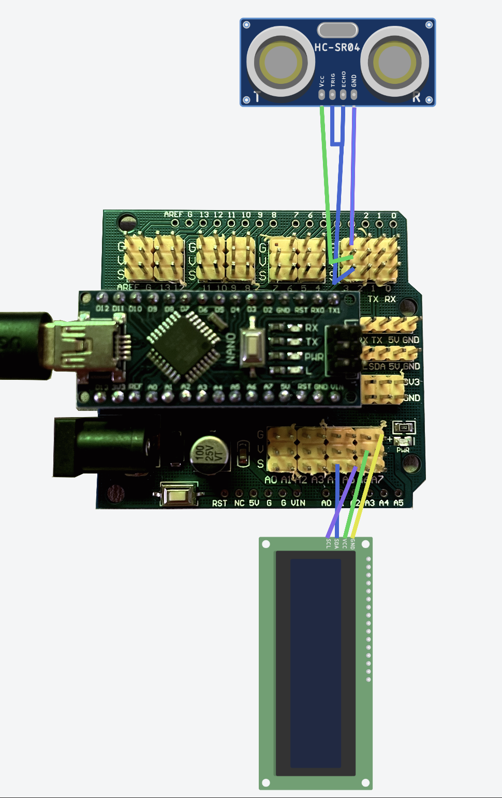

# <span style="color: #FDFD96;">Arduino</span>

Arduino es una plataforma de prototipos (está diseñado para que los usuarios creen y experimenten con ideas antes de implementar un producto final) de código abierto. Se basa en hardware y software flexibles y fáciles de usar que ponen al alcance de cualquier persona la construcción de circuitos electrónicos.

### <span style="color: #5F9EA0;">Componentes Principales de Arduino</span>

<span style="color: #B2A4D4;">**Placas de Desarrollo:**</span>
Hay varios modelos de placas Arduino, como el Arduino Uno, Arduino Mega, y Arduino Nano, entre otros. Cada una de las placas lleva un microcontrolador en el que se carga el programa que se quiera ejecutar.

<span style="color: #B2A4D4;">**Microcontrolador:**</span>
Es el cerebro de la placa Arduino. Es donde la placa almacena el programa que tiene que ejecutar.

El microcontrolador de la placa se programa utilizando el IDE de Arduino.

<span style="color: #B2A4D4;">**Entradas y Salidas (I/O):**</span>
Las placas Arduino tienen pines de entrada y salida digital y analógica que permiten la interacción con sensores, actuadores y otros componentes electrónicos.

<span style="color: #B2A4D4;">**IDE de Arduino:**</span>
El Entorno de Desarrollo Integrado de Arduino es una aplicación que se utiliza para escribir, compilar y cargar programas en las placas Arduino. Utiliza un lenguaje de programación basado en C/C++.


### <span style="color: #5F9EA0;">Componentes comunes en los montajes</span>

<span style="color: #B2A4D4;">**Cables:**</span> usaremos cables macho-hembra, macho-macho o hembra-hembra en función de lo que necesitemos conectar en cada proyecto.

<span style="color: #B2A4D4;">**Resistencia:**</span> es un pequeño componente que se utiliza para limitar o controlar la cantidad de corriente eléctrica que fluye a través de un circuito.

<span style="color: #B2A4D4;">**Led:**</span> es dispositivo que emite luz cuando se encuentra en polarización directa, es decir el ánodo (pata larga) está conectado a un polo positivo y la pata corta (cátodo) a un polo negativo.

<span style="color: #B2A4D4;">**Protoboard:**</span>
Es una placa de plástico con contactos metálicos que nos permite montar circuitos eléctricos y electrónicos de manera fácil, temporal y sin tener que soldar.


Dentro del <span style="color: #FDFD96;">**protoboard**</span> hay laminillas metálicas conductoras que permiten interconectar componentes y permiten el flujo de la corriente eléctrica.


La corriente de carga negativa pasa por la línea azul, donde está conectada la resistencia. La resistencia también está conectada en el canal central, en este canal está conectada la carga negativa del led (cátodo - pata corta). El ánodo (pata larga y positiva). No se ve en la imagen, pero el ánodo está conectado a la carga positiva.

No importa si la resistencia está conectada antes de la carga negativa o de la carga positiva. Pero necesitamos conectar una resistencia porque el led no soporta el voltaje tan alto y podría petar.


Sí que es importante hacer las conexiones en los agujeros correctos. Si conectamos la carga negativa de la pila en el canal de - de protoboard, no podemos conectar la resistencia o el cátodo al + del protoboard.

Existen <span style="color: #B2A4D4;">**otros componentes**</span> como <span style="color: #FDFD96;">**potenciómetro, zumbador, sensor de humedad, de temperatura, sensor de luz, ultrasonidos, patalla...**</span>

### <span style="color: #5F9EA0;">IDE de Arduino</span>

<span style="color: #B2A4D4;">**Estructura de un programa**</span>

El programa en Arduino está compuesto por dos secciones diferentes y obligatorias en las que se codifican diferentes componentes del programa.

https://support.arduino.cc/hc/en-us/articles/360019833020-Download-and-install-Arduino-IDE


Arduino utiliza un lenguaje llamado C/C++, la palabra clave que se utiliza para definir las funciones (que no retornan nada) es void. Para usar funciones que retornan algún valor se usa la tipología del valor que devuelven. 

```cpp
int suma(int a, int b) {
    return a + b;
}
```


En la primera sección del programa, <span style="color: #FDFD96;">**setup()**</span>, es donde se define la configuración del programa, es decir, donde se codifican todas las sentencias de configuración, inicialización de los puertos de la placa, configuración de las comunicaciones y otros parámetros que dependerán de cada programa que se desarrolle. "Definimos los actores"

En la segunda sección del programa, <span style="color: #FDFD96;">**loop()**</span>, es donde se codifica el programa que se ejecutará de forma cíclica en Arduino. Esta sección está compuesta por todas las sentencias que componen el programa y que llevarán a cabo todas las operaciones que lo compongan. "Se desarrollan las acciones"

<span style="color: #B2A4D4;">**Hello World**</span>

<span style="color: #FDFD96;">**pinMode(pin, mode)**</span> es una función reservada en Arduino. Se utiliza para configurar un pin específico de la placa de Arduino como una entrada o una salida. 

<span style="color: #FDFD96;">**digitalWrite(pin, value)**</span> es otra función reservada en Arduino. Se utiliza para escribir un valor (alto o bajo) en un pin digital que haya sido configurado previamente como salida usando pinMode(). 


- <span style="color: #FDFD96;">**setup()**</span>: Configura el pin 7 como una salida.
- <span style="color: #FDFD96;">**loop()**</span>: Hace que el LED conectado al pin 7 parpadee. Primero, enciende el LED y espera 1 segundo, luego apaga el LED y espera otro segundo. Este ciclo se repite indefinidamente.

<span style="color: #FDFD96;">**digitalWrite**</span>, <span style="color: #FDFD96;">**pinMode**</span> o <span style="color: #FDFD96;">**delay**</span> son funciones predefinidas que forman parte de la biblioteca de Arduino.




### <span style="color: #5F9EA0;">JOHNNY-FIVE + FIRMATA</span>


<span style="color: #FDFD96;">**Johnny-Five**</span> es una biblioteca de JavaScript que permite controlar y programar hardware (como placas de Arduino) usando JavaScript. 

<span style="color: #FDFD96;">**Firmata**</span> es un protocolo de comunicación que permite a un ordenador comunicarse y controlar una placa Arduino (u otro microcontrolador) desde otro software, como Johnny-Five. 

<span style="color: #B2A4D4;">**Cargar Firmata en Arduino**</span>


<span style="color: #B2A4D4;">**Hello World con Johnny-Five**</span>

Johnny-Five es una biblioteca que trabaja mejor con CommonJS se puede trabajar con ECMAScript 6 (ES6), pero la mayoría de ejemplos que vamos a encontrar aún usan require. 



(Tenemos que tener instalado Node.js)


https://johnny-five.io/


** Si hemos clonado el repositorio, es posible que tenga una versión antigua de node **

```cpp
npm rebuild // recopilamos los módulos nativos
rm -rf node_modules // eliminamos las dependencias instaladas
npm intall // reinstalamos desde 0 con nuestra versión de node
npm install johnny-five // instalamos johnny-five
```

<span style="color: #B2A4D4;">**Traffic Lights con Johnny-Five**</span>



https://johnny-five.io/examples/


<span style="color: #B2A4D4;">**Servo Motor**</span>
Es un dispositivo que permite controlar la posición y movimientos de su eje. Se puede mover en un ángulo (0-180), posición y a una velocidad determinada. Tiene 3 pines: alimentación (5V), tierra (GND) y el pin de la señal.

https://johnny-five.io/examples/servo/




### <span style="color: #5F9EA0;">DIGITAL MEASURING</span>

El <span style="color: #FDFD96;">**Arduino Nano**</span> es una versión compacta del Arduino Uno, está pensado para proyectos de espacio reducido. Al Arduino Nano se le puede acoplar un <span style="color: #FDFD96;">**Shield**</span> de expansión, que proporciona un mejor acceso a los pines y facilita la conexión.



Trabajaremos con Arduino Nano + Shield para poder conectar fácilmente diversos dipositivos. 



Para usar esta placa con Johnny-Five, también tenemos que cargar la librería Firmata. Pero en este caso, añadiremos la librería PingFirmata para poder usar el sensor ultrasónico.

<span style="color: #B2A4D4;">**Hello ISDI con Johnny-Five**</span>

Vamos a trabajar con <span style="color: #FDFD96;">**El monitor LCD 16x2 con interfaz I2C**</span>, un componente popular en proyectos de Arduino. Ofrece la posibilidad de mostrar hasta 16 caracteres en 2 filas (16 columnas, 2 filas).

La interfaz I2C permite la comunicación entre el microcontrolador y el LCD usando sólo 2 cables para la comunicación de datos: SDA (transmisión de datos) y SCL (sincronización del reloj de la comunicación). Son necesarios también los cables de alimentación (GND y 5V).

https://johnny-five.io/examples/lcd-i2c/


Vemos que no se indica en qué pines se tiene que conectar SDA y SCL es porque por defecto, se colocan el SDA en el pin A4 y el SCL en el pin A5.




<span style="color: #B2A4D4;">**Proximity HCSR04 con Johnny-Five**</span>

El sensor de proximidad <span style="color: #FDFD96;">**HC-SR04**</span> se usa para medir distancias. Funciona emitiendo pulsos de ultrasonido y midiendo el tiempo que tarda en rebotar en un objeto y volver al sensor. Así el sensor, puede calcular la distancia que hay entre el sensor y ese objeto. 

Los pines del sensor son: VCC (alimentación - 5V), GND (tierra), TRIG (inicia la medición, se envía un pulso alto de 10 microsegundos) y ECHO (pin de salida que recibe el eco y se pone alto en función del tiempo que tarda el sonido en regresar)

Para poder usar este sensor con Johnny-Five, tenemos que cargar la librería PingFirmata y hacer un puente entre TRIG y ECHO, ya que se controla en un mismo pin.

https://johnny-five.io/examples/proximity-hcsr04/




<span style="color: #B2A4D4;">**Monitor + HCSR04 con Johnny-Five**</span>




### <span style="color: #5F9EA0;">FINAL PRACTICE</span>